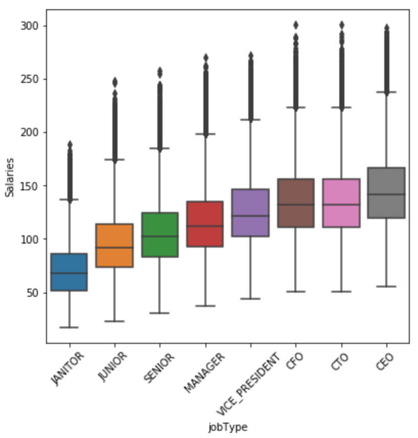
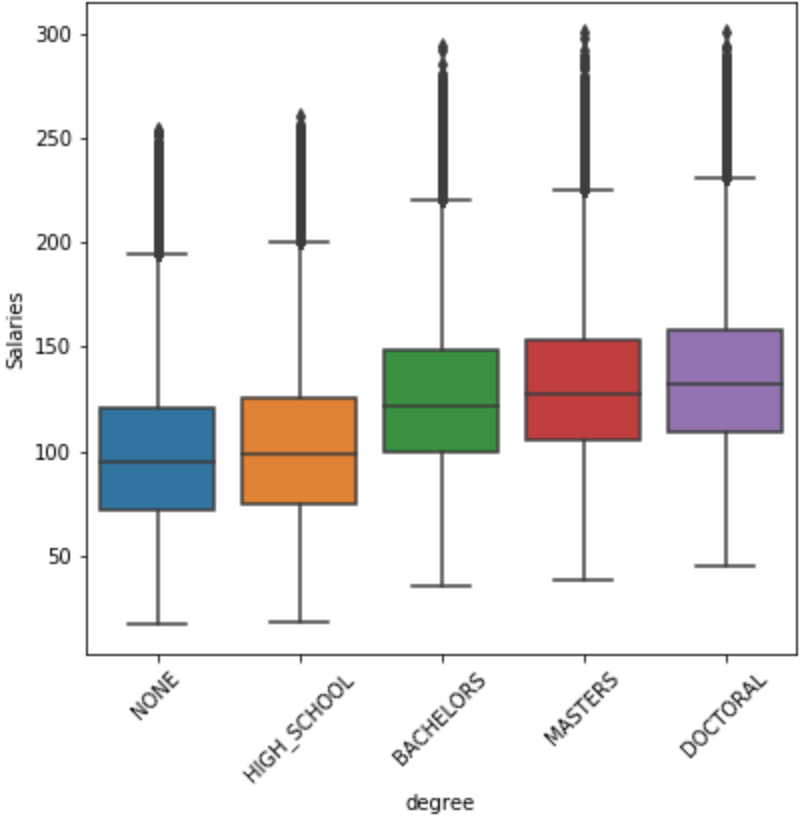
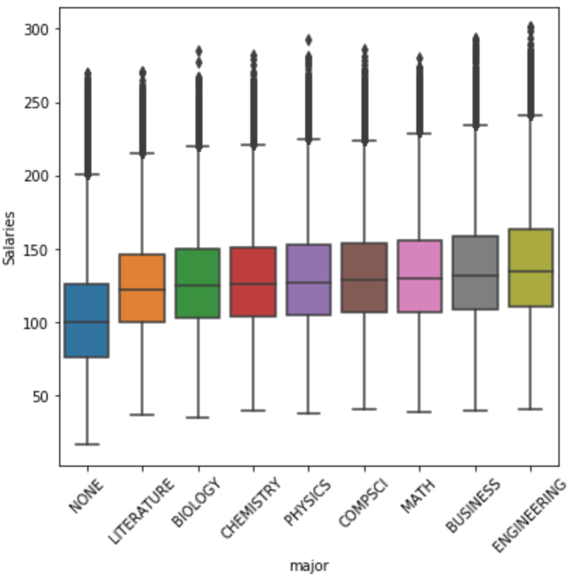
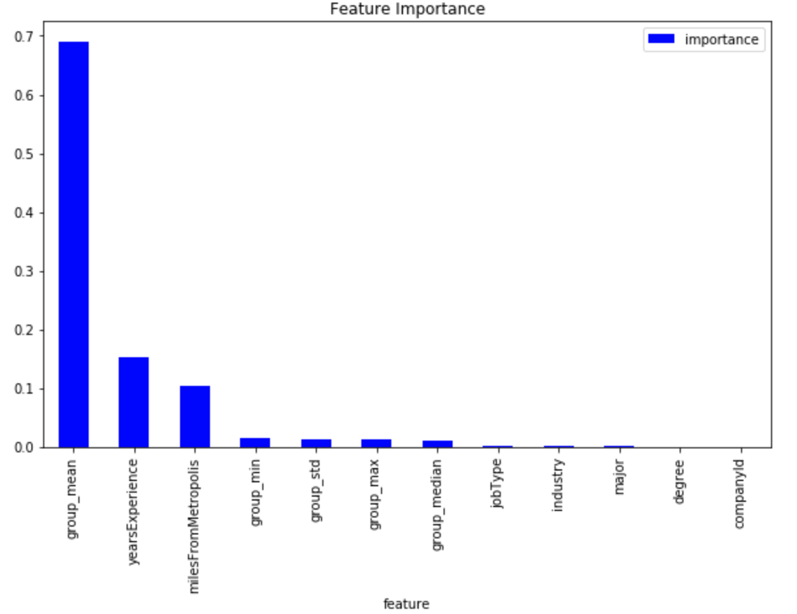

# Predicting Future Employee Salary Based on Current Employee Attributes

Introduction:

The goal of this project is to predict the salary of a new job posting with the help of job details like degree, experience, seniority etc. The model is then later tested on a test data set to validate the accuracy of the model.

The three datasets used for this project are train , test and train salaries. The model is trained using train dataset which has the features jobid, companyid, jobtype, major, degree, industry and the train salaries dataset which has the features jobid and the target variable salary.

The tool used is Python 3 along with its libraries and packages such as numpy, pandas, matplotlib, seaborn and sklearn to do data manipulation, data visualization and building the predictive model.

## Data Cleaning:
The data was checked for missing and Duplicate values. There were five entries with salary <= 0. So a new dataframe was defined with salaries greater than 0.

## Exploratory data analysis(EDA):
Numerical and categorical varibles were identified and summarized separately. There are two numerical features - yearsExperience and milesFromMetropolis. The feature jobId and companyId was not used to build the model. The categorical features are jobType with 8 unique values, degree, major and industry with 5,9,7 unique values respectively.

### Visualizing Target(Salary) Variable:

In the target variable's plot there were some suspicious potential outliers. 1.5 IQR rule was used to find the upper and lower bound of suspected outliers. There are 20 Junior positions with salary above the upper bound 220.5. But after investigating the data, it was clear that those data should be good as those entries had atleast 18 years of experience and almost most of them has masters or doctoral degree.

### Relationship between Target and Input Variable:

**From the EDA we can see that:

1. Job type has a strong positve correlation with salary. That is senior job types has highest salary.  

2. Oil and finance are the highest paying industries.  

3. Those with more years of experience are paid higher. 

4. As the distance from metropolis decreases, salary increases. 

Apart from this to get an idea about the correlation between features, a heatmap was plotted.

### Feature Engineering
The training data was cleaned, shuffled and reindexed and using one hot encoding categorical data was encoded to get the final training and test dataframes.

### Model Selection and Evaluation:
The three different regreesion algorithms selected were 1.Linear Regression  2. Make-pipleline 3.Gradient Boosting Regressor

Mean Squared Error(MSE) is selected as the evaluation metric. The model with lowest MSE is selected has the best model.

### Best Model:
After doing 2 fold cross validation on each selected models, the following MSE was measured for corresponding models

1. Linear Regression - 384.47. 

2. Pipeline - 384.50. 

3. Gradient Boosting Regressor - 357.17

So Gradient Boosting Regressor with the lowest MSE was selected as the best model. The model was trained on the entire data set and prdeictions were created based on the test data. Key predictors for this model are JobType and milesFrom Metropolis as shown in the Feature Importances plot.

#### Feature Importance:

## Conclusion:
The Predictive model is working fine and is able to predict salaries for the test dataset. The evaluation metric considered was MSE(Mean Squared Error). THe MSE obtained for the model is 357.76 .There is scope for improvement on the model if advanced feature engineering and stacking/ensembling methods are used.

