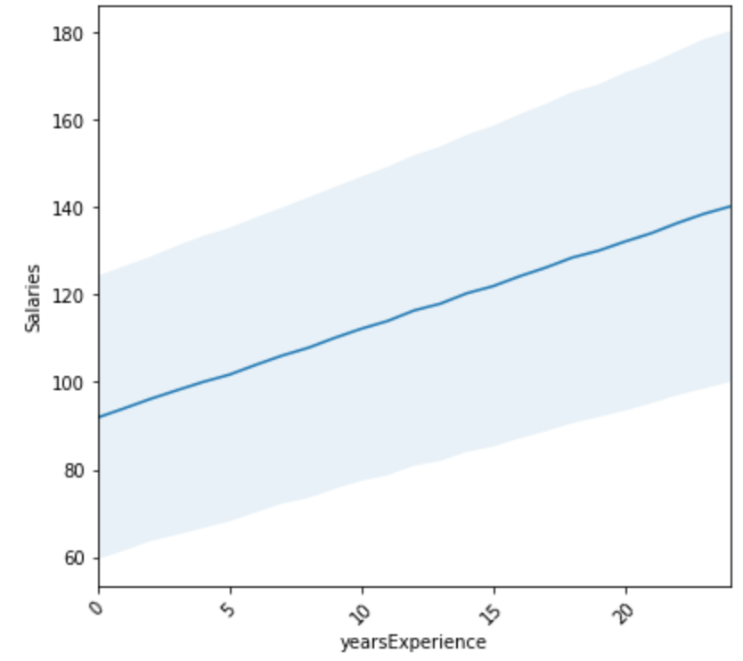

# Predicting Future Employee Salary Based on Current Employee Attributes

Introduction:

The goal of this project is to predict the salary of a new job posting with the help of job details like degree, experience, seniority etc. The model is then later tested on a test data set to validate the accuracy of the model.

The three datasets used for this project are train_features, train_salaries and test_features. The train feature dataset originally contains jobid, companyid, jobtype, major, degree, industry. The train salaries dataset contains the corresponding jobId associated with the salary. There the two data sets were merged as train dataset using the jobId illustrated below.  

There is also a test dataset given without salary of employee which we will be determining throughout this model. 

The tool used is Python 3 along with its libraries and packages such as numpy, pandas, matplotlib, seaborn and sklearn to do data manipulation, data visualization and building the predictive model.

## Data Cleaning:
The data was found with no missing and duplicate values but there were five entries with salary <= 0. Therefore, these data were removed from the dataset. 

## Exploratory data analysis(EDA):
Numerical and categorical varibles were identified and summarized separately. There are two numerical features - yearsExperience and milesFromMetropolis. The feature jobId and companyId was not used to build the model. The categorical features are jobType with 8 unique values, degree, major and industry with 5,9,7 unique values respectively.

### Visualizing Target(Salary) Variable:

Based on the target variable's plot there are some suspicious potential outliers. Using Statistical Inter-Quartile Range, we find the upper and lower bound of suspected outliers. There are 20 Junior positions with salary above the upper bound 220.5. After investigating the data, it is clear that those data should be good to use as those employees have atleast 18 years of experience and almost most of them has masters or doctoral degree.

### Relationship between Target and Input Variable:  
### From the EDA we can see that:
  
The salary is weakly associated with company ID. 

There is a clear positive correlation between job type and salary. 

More advanced degrees correspond to higher salaries. 

People with majors of engineering, business and math generally have higher salaries. 

As for industries, oil, finance and web industries generally pay better. 
 
In general there is a clear correlation between salary and years of experience. 
  
In general, salaries decrease as the distance to metropolies increases. 
Apart from this to get an idea about the correlation between features, a heatmap was plotted.

### Feature Engineering
The training data was cleaned, shuffled and reindexed and using one hot encoding categorical data was encoded to get the final training and test dataframes.
We found from Exploratory data Analaysis Heatmap that:
There is a weak positive relationship (0.38) between salary and yearsExperience. There is a weak negative relationship between (-0.3) salary and milesFromMetropolis. The prediction will be unreliable with weak correaltion. Therefore, We engineered new features to enhance model performance.

**New Features:Calculate descriptive statistics by aggregating categorical features (Eg: Group_mean, Group_min, Group_max, Group_std)**

### Model Selection and Evaluation:
The three different regreesion algorithms selected were 1.Linear Regression  2. RandomForest Regressor 3.Gradient Boosting Regressor

Mean Squared Error(MSE) is selected as the evaluation metric. The model with lowest MSE is selected as the best model.

### Best Model:
After doing 2 fold cross validation on each selected models, the following MSE was measured for corresponding models

1. Linear Regression - 384.49 (base model) However, it was reduced to 358.16 after implementing new feature to the train data set   

2. RandomForest Regressor - 314.88. 

3. Gradient Boosting Regressor - 313.36

So Gradient Boosting Regressor with the lowest MSE was selected as the best model. The model was trained on the entire data set and prdeictions were created based on the test data. Key predictors for this model are Group_mean followed by yearsExperience as shown in the Feature Importances plot.

#### Feature Importance:

## Conclusion:
The Predictive model is working fine and is able to predict salaries for the test dataset. The evaluation metric considered was MSE(Mean Squared Error). The MSE obtained for the model is 313.36.
